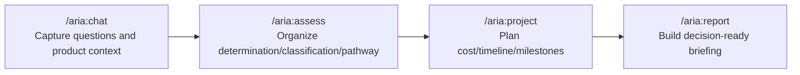

# Cowork-RA

Anthropic Cowork plugin marketplace for Regulatory Affairs workflows.

[Korean (default)](./README.md) | [English](./README.en.md)

Korean source: [`README.md`](./README.md)

## Overview

`Cowork-RA` is a marketplace repository for installing and using the ARIA plugin in Cowork.

ARIA is designed to feel like talking with a senior RA partner, helping you keep regulatory reasoning in one connected flow.  
It does not replace final human judgment, but it reduces context loss and repeated prompting so teams can move faster with better consistency.

## When ARIA Fits Best

| | |
|---|---|
| When context keeps breaking | Keep product profile, markets, and regulatory reasoning connected in one flow. |
| When prompts get repetitive | Reuse previous conversation context and move to the next step faster. |
| When you need decision-ready output | Turn chat context into assess/project/report outputs for stakeholders. |

## Chat vs ARIA

| Area | General Chat (LLM) | ARIA |
|------|--------------------|------|
| Context continuity | Context can fragment across sessions | Carries regulatory context forward across the workflow |
| Repeat instructions | Product profile and constraints are often repeated | Reuses prior context to reduce re-instruction overhead |
| Output consistency | Response format/depth can vary by prompt | Structured outputs aligned to assess/project/report flow |
| Execution flow | Strong for one-off Q&A | Connected flow: `/aria:chat -> /aria:assess -> /aria:project -> /aria:report` |

## 1-Minute Onboarding Flow

## Skill-Driven RA Support

ARIA is designed around practical RA skills, not just command wrappers.

| Skill | What it handles in practice | Practical value |
|------|------------------------------|-----------------|
| `determination` | Medical device determination | Faster early Go/No-Go decisions |
| `classification` | FDA/EU/MFDS risk class mapping | Better market-by-market strategy alignment |
| `pathway` | Submission/pathway comparison | Earlier visibility into pathway tradeoffs |
| `estimation` | Three-point cost/timeline estimates | Stronger planning assumptions |
| `planning` | Milestones and dependency planning | Clear execution roadmap |
| `compliance` | **Medical Device Fair Competition Code** checks (samples, sponsorship, lectures, congress support, etc.) | Covers a core RA compliance workflow in conversational form |
| `humanized-writing` | Refines AI-first drafts into human-ready business writing | Reduces "AI-sounding" output cleanup effort |

## Quick Start

| Command | Purpose | Example |
|---------|---------|---------|
| `/aria:chat` | Conversational advisory + product profiling | `/aria:chat Is an ECG wearable a medical device?` |
| `/aria:assess` | Integrated assessment (determination/classification/pathway) | `/aria:assess Wearable device for arrhythmia detection` |
| `/aria:project` | Cost/timeline and milestone planning | `/aria:project --format markdown` |
| `/aria:report` | End-to-end executive briefing | `/aria:report --lang en` |

Recommended flow:
`/aria:chat -> /aria:assess -> /aria:project -> /aria:report`

## Installation

1. Install the Claude Desktop App.
   - https://claude.com/download
2. Select the Cowork tab in the Claude Desktop App.
3. Navigate to the plugin installation page in Cowork.
- Plugins -> + button (Add Plugin) -> Browse Plugins -> Personal -> +, Add marketplace from GitHub
- Enter the GitHub URL below
  - `https://github.com/henry-1981/Cowork-RA.git`

## Documentation Links

- ARIA power-user guide: [`aria/README.md`](./aria/README.md)
- Skill deep dive (including compliance and writing quality): [`aria/README.md#skill-deep-dive`](./aria/README.md#skill-deep-dive)
- Command specs:
  - [`aria/commands/chat.md`](./aria/commands/chat.md)
  - [`aria/commands/assess.md`](./aria/commands/assess.md)
  - [`aria/commands/project.md`](./aria/commands/project.md)
  - [`aria/commands/report.md`](./aria/commands/report.md)
- Connector details: [`aria/CONNECTORS.md`](./aria/CONNECTORS.md)
- Changelogs: [`CHANGELOG.md`](./CHANGELOG.md), [`aria/CHANGELOG.md`](./aria/CHANGELOG.md)

## Troubleshooting

- ARIA works with built-in regulatory knowledge even when some MCP connectors are unavailable.
- Output formats (`pdf`, `notion`, `gdocs`) depend on connector/tool availability in your environment.

## License

[Apache-2.0](./aria/LICENSE)
