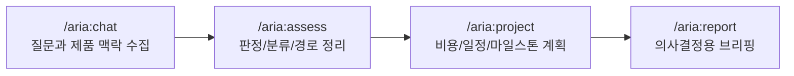

# Cowork-RA

Anthropic Cowork plugin marketplace for Regulatory Affairs workflows.

[한국어 (기본)](./README.md) | [English](./README.en.md)

## 개요

`Cowork-RA`는 Cowork에서 ARIA 플러그인을 설치하고 사용할 수 있도록 제공하는 마켓플레이스 저장소입니다.

ARIA는 10년차 RA와 대화하듯, 규제 판단 흐름을 이어주는 실무형 플러그인입니다.  
모든 답을 대신하진 않지만, 맥락 누락과 반복 지시를 줄여 판단을 더 빠르게 정리할 수 있습니다.

## 이런 상황에 잘 맞습니다

| | |
|---|---|
| 맥락이 자꾸 끊길 때 | 제품 정보, 시장, 규제 이슈를 대화 흐름 안에서 이어서 검토합니다. |
| 같은 지시를 반복할 때 | 앞선 대화를 바탕으로 다음 분석 단계로 연결합니다. |
| 결과를 보고용으로 정리해야 할 때 | chat 결과를 assess/project/report 흐름으로 이어서 정리합니다. |

## 기존 Chat vs ARIA

| 항목 | 기존 Chat(LLM) | ARIA |
|------|----------------|------|
| 맥락 유지 | 세션이 바뀌면 핵심 맥락이 끊기기 쉬움 | 규제 검토 흐름을 이어가며 컨텍스트를 누적 |
| 반복 지시 부담 | 제품/시장/요건을 반복 입력하기 쉬움 | 앞선 대화/분석 결과를 기반으로 다음 단계 연결 |
| 결과 일관성 | 답변 형식과 깊이가 요청마다 달라질 수 있음 | assess/project/report 흐름으로 구조화된 산출 |
| 실행 흐름 | 질의응답 단위 활용에 강함 | `/aria:chat -> /aria:assess -> /aria:project -> /aria:report` 연결 |

## 1분 온보딩 플로우

## Quick Start

| 명령어 | 용도 | 예시 |
|--------|------|------|
| `/aria:chat` | 대화형 자문 + 제품 정보 수집 | `/aria:chat 심전도 웨어러블이 의료기기인가요?` |
| `/aria:assess` | 규제 평가(판정/분류/경로) 통합 실행 | `/aria:assess 부정맥 감지 웨어러블 장치` |
| `/aria:project` | 비용/일정/마일스톤 계획 생성 | `/aria:project --format markdown` |
| `/aria:report` | 전체 결과 통합 브리핑 생성 | `/aria:report --lang en` |

권장 실행 순서:
`/aria:chat -> /aria:assess -> /aria:project -> /aria:report`

## Installation

1. Cowork에서 플러그인 설치 화면으로 이동합니다.
2. 아래 방식 중 하나를 사용합니다.

- GitHub URL 설치
  - `https://github.com/henry-1981/Cowork-RA.git`
- ZIP 업로드 설치
  - 저장소 ZIP 다운로드 후 업로드

## 문서 링크

- ARIA 파워 유저 가이드: [`aria/README.md`](./aria/README.md)
- 명령 상세 스펙:
  - [`aria/commands/chat.md`](./aria/commands/chat.md)
  - [`aria/commands/assess.md`](./aria/commands/assess.md)
  - [`aria/commands/project.md`](./aria/commands/project.md)
  - [`aria/commands/report.md`](./aria/commands/report.md)
- 커넥터 상세: [`aria/CONNECTORS.md`](./aria/CONNECTORS.md)
- 변경 이력: [`CHANGELOG.md`](./CHANGELOG.md), [`aria/CHANGELOG.md`](./aria/CHANGELOG.md)

## 문제 해결

- 일부 MCP 커넥터가 없어도 ARIA는 내장 지식 기반으로 동작합니다.
- 출력 형식(`pdf`, `notion`, `gdocs`)은 사용 환경의 도구/커넥터 가용성에 따라 달라집니다.

## 라이선스

[Apache-2.0](./aria/LICENSE)
